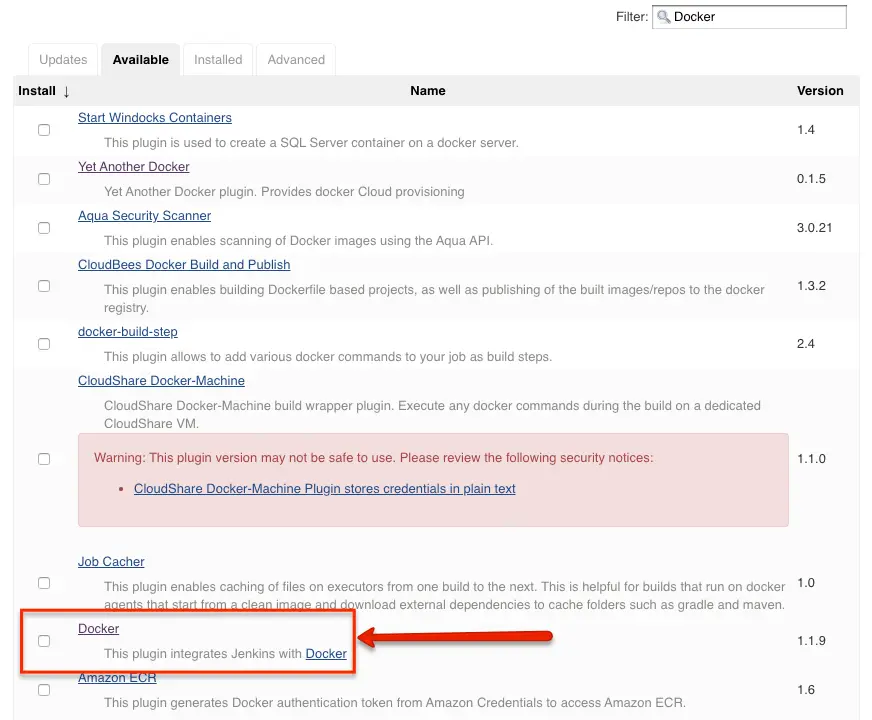
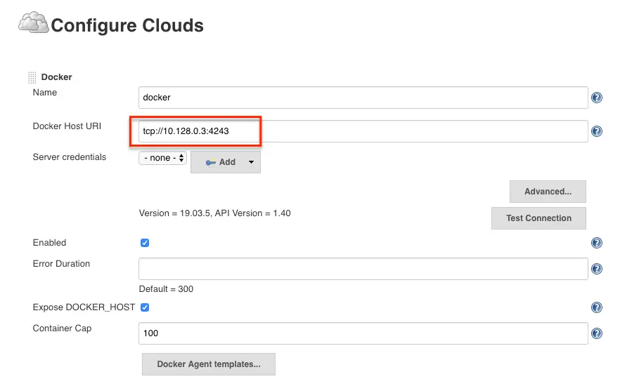
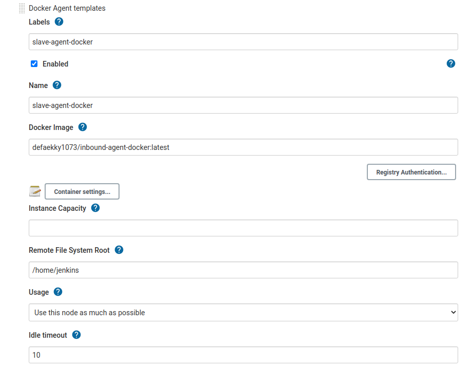
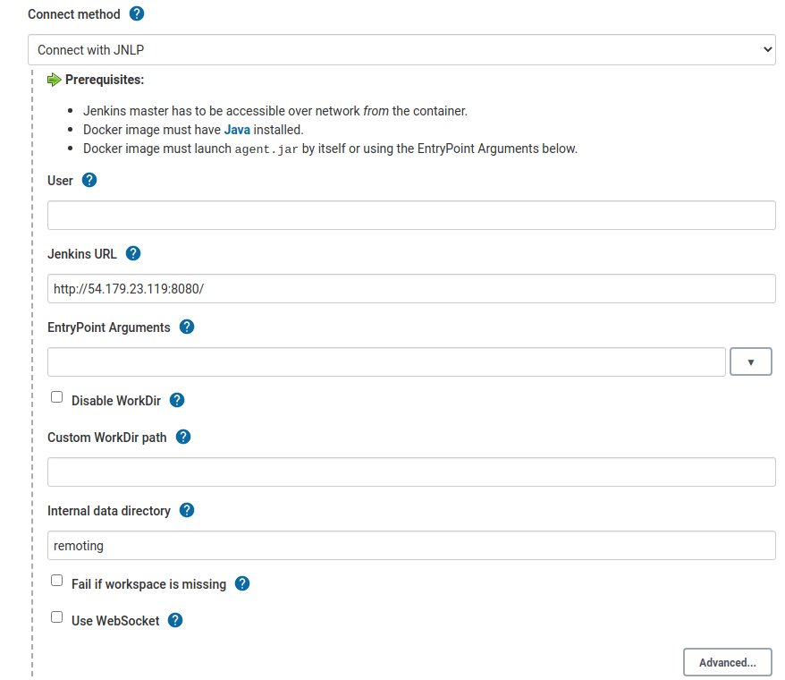
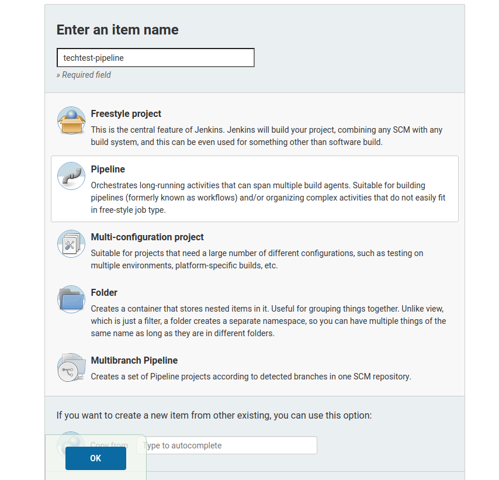
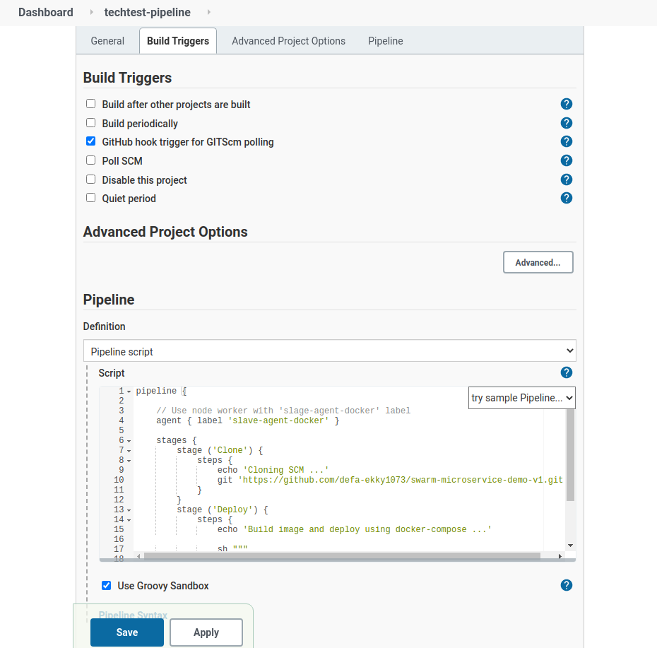
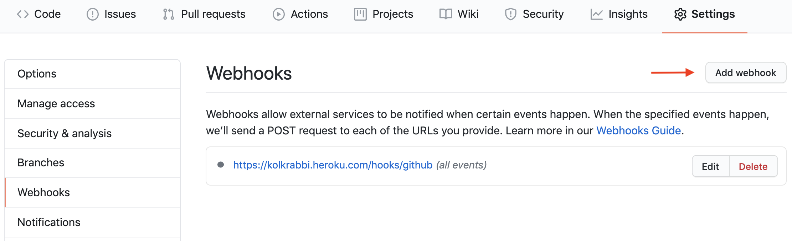
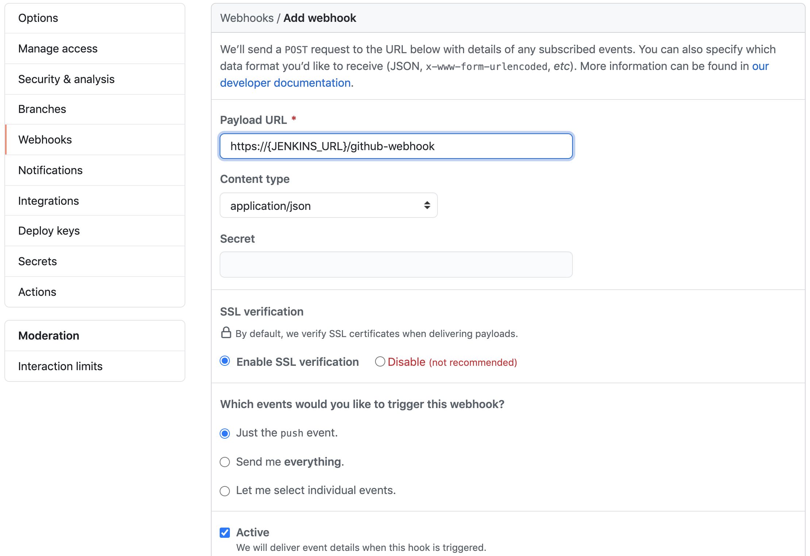

# Techtest-Submit
Repository used to submit Techncal Test

---
## HOW PIPELINE WORK
The pipeline simply work by pulling the code from SCM then build the image and it's dependencies using the provided `docker-compose.yml` and `Dockerfile` inside each apps directory 

---
## STEP BY STEP TO SETUP THE PIPELINE
Required tools
- Terraform
- Chef Workstation

### Step 1: Provision The Instance Using Terraform
With the provided terraform script inside terraform directory, create `terraform.tfvars` and fill out with your AWS Provider setting

```
# terraform.tfvars

AWS_ACCESS_KEY = "aws_access_key"
AWS_SECRET_KEY = "aws_secret_key"
AWS_REGION = "aws_region"
AWS_VPC_SG = ["aws_sg"]
```

then run

> terraform init

To initiate the terraform and install all required plugin

> terraform plan

To layout the terraform plan to be applied

> terraform apply

To apply the specified plan to the provider

### Step 2: Upload Techtest Cookbook to your Chef Server/Chef Manage
With assumption that you have installed the Chef Workstation ([instruction here](https://docs.chef.io/workstation/install_workstation/)) and have Chef Server/Chef Manage fired up and ready to go, you can copy techtest cookbook directory to your `chef-repo` cookbook directory, then run

> berks install

To install all the dependencies required by the cookbook (You must be on the same directory as the Berkfile to accomplish this task, which is on `chef-repo/cookbook/techtest`)

> berks upload

To upload the cookbook and it's all dependencies to your Chef Server/Chef Manage (You must be on the same directory as the Berkfile to accomplish this task, which is on `chef-repo/cookbook/techtest`)

### Step 3: Configure The Provisioned Instance Using Chef
Once you uploaded the required cookbook and all of it's dependencies, you ready to fire up the cookbook to configure the provisioned instance
***"note: Because `Chef Provisioner` were removed in 0.15.0 version of Terraform, The Author hasn't yet explore the automated way to bootstrap the provisioned node, hence you must do it manually"***

To achieve this you could run

> knife bootstrap FQDN -u USER -i KEY --sudo -N NODE_NAME --run-list 'RECIPE_TO_RUN'

To make things easier and quicker, The Author has make sh file to bootstrap the instance, named `boostraper.sh` in the main directory of this repo,
To make use of the bootstraper, you need to provide the node name (wich also count as it's type; currently only supporting 2 type, master and slave) and it's FQDN/URI.
Run:

> sh bootstraper.sh master MASTER_URI

To bootstrap the mentioned instance as Master Node, where chef would apply the configuration for Master Operation (`recipe(techtest::default)`)

> sh bootstraper.sh slave-n SLAVE_URI

To bootstrap the mentioned instance as Slave Node, where chef would apply the configuration for Slave Operation (`recipe(techtest::slave)`)

### Step 4: Installing Jenkins Required Plugins
***"note: Because Chef Recipe for `jenkins_plugin` is currently bugged, The Author hasn't yet have enough time to explore the automated way to install the required jenkins plugin, you have to do it manually using Jenkins GUI"***
To install all the required plugin, you need to go into the Jenkins GUI (default port: **8080**)

> http://MASTER_URI:8080

Go to **Manage Jenkins -> Manage Plugins -> Available Tab** and install
 - `GitHub`
 - `Docker`
and click **"Install without restart"**

And wait until the installation is finished

### Step 5: Registering The Slave Node To Jenkins Master
***"note: Because The Author hasn't yet have enough time to explore the automated way to Register the Slave Node to Jenkins Master, you have to do it manually using Jenkins GUI"***
To register the Slave Node to Jenkins Master, you need to go into the Jenkins GUI (default port: **8080**)

> http://MASTER_URI:8080

Go to **Manage Jenkins -> Manage Nodes and Clouds -> Configure Clouds -> Docker Cloud details...**

Under the docker, you need to fill out the details just like shown in the image above

> Replace the `Docker URI` with your SLAVE_URI, then use the `Test connection` to test if Jenkins is able to connect to the Docker Host, Also tick out the `Enabled` chekbox

Then click **Docker Agent templates... -> Add Docker Template** to configure the Docker Image to be used by the Jenkins Master


> - **Labels** – Identification for the docker host. It will be used in the Job configuration. Here we use `slave-agent-docker`
> - **Name** – Name of the docker template. Here we use the same name as label ie, `slave-agent-docker`
> - **Docker Image** – `defaekky1073/inbound-agent-docker:latest` or the image that you created for the slave.
> - **Remote File System Root** – Home folder for the user you have created. In our case, it’s `/home/jenkins`

In the **Connect method**, pick `Connect with JNLP`


> Fill out **Jenkins URL** with your `MASTER_URI:8080`

Save and you've done registering the slave node

### Step 6: Creating Pipeline
***"note: Because The Author hasn't yet have enough time to explore the automated way to Creating Pipeline, you have to do it manually using Jenkins GUI"***
To create pipeline, click the **New Item** on the side bar of Jenkins Dashboard


> - **Name** – Pipeline Name, fill it wiht your desired name
> - Pick `Pipeline` in the list of item
> - Click `OK` button to continue

On the next page, fill out as shown bellow


> - Check the **GitHub hook trigger for GITScm polling** as the mean of pipeline trigger
> - Simply paste the content of provided `jenkinsfile` inside the pipeline script textbox
> - Click Save

Now the Pipeline should be ready to do some work
***"note: Because there's missing dependencies on vote-worker Dockerfile, the mentioned pipeline should fail to run"***

---
## HOW TO DEPLOY CHANGES IN REPO
The pipeline is triggered by `GitHub hook trigger for GITScm polling` option inside pipeline setting in Jenkins GUI

To do so, open your repository in the browser, then go to `Settings > Webhooks` and click `Add webhook`


Then, enter your `MASTER_URI:8080` followed by `/github-webhook/` and select the other options depending on your needs:
